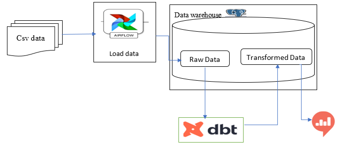

# Data Engineering: Data warehouse tech stack with PostgreSQL, DBT, Airflow
## Objective 
A city traffic department wants to collect traffic data using swarm UAVs (drones) from a number of locations in the city and use the data collected for improving traffic flow in the city and for a number of other tasks. Now the objective is creating a scalable data warehouse that will host the vehicle trajectory data extracted by analyzing footage taken by swarm drones and static roadside cameras.
## Data source 
The data can be found [here](https://open-traffic.epfl.ch/index.php/downloads/#1599047632450-ebe509c8-1330)

## Tech-Stack Flow Diagram

## Tools used in this project
- [Dbt](https://docs.getdbt.com/docs/building-a-dbt-project/documentation)
- [Apache Airflow](https://airflow.apache.org/docs/apache-airflow/stable/howto/docker-compose/index.html)
- [Postgresql](https://www.guru99.com/download-install-postgresql.html) 
- [Redash](https://redash.io/)
- [Snowflake](https://docs.snowflake.com/en/)

