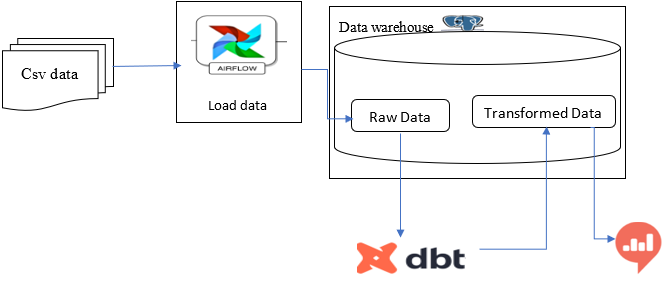

# Data Engineering: Data warehouse tech stack with PostgreSQL, DBT, Airflow
## Objective 
A city traffic department wants to collect traffic data using swarm UAVs (drones) from a number of locations in the city and use the data collected for improving traffic flow in the city and for a number of other tasks. Now the objective is creating a scalable data warehouse that will host the vehicle trajectory data extracted by analyzing footage taken by swarm drones and static roadside cameras.

## Tech-Stack Flow Diagram


## Data
The data can be found [here](https://open-traffic.epfl.ch/index.php/downloads/#1599047632450-ebe509c8-1330)

## Requirements

> Pip

> Apache airflow

> Python 3.5 or above

> Docker and Docker compose

You can find the full list of requirements in the requirements.txt file

## Install

> We highly recommend you create a new virtual environment and install every required modules and libraries on the virtual environment.

### Installing this application

- You can clone and run the project using the following instruction 

```
git clone https://github.com/Data-warehouse_DBT_Airflow.git
cd Data-warehouse_DBT_Airflow
pip install -r requirements.txt
```

## Screenshots

> The detailed use and implementation of the pipelines using Apache Airflow, DBT, postgres and Redash are found here.

## Notebooks

> The notebooks that are used in this project including EDA, data cleaning are found here in the Notebooks folder.

## Scripts

> All the scripts and modules used for this project relating to interactions with the kafka, airflow, spark and other frameworks along with default parameters and values used will be found here, in the scripts folder.

## Tests

> All the unit and integration tests are found here in the tests folder.


## Tools used in this project
- [Dbt](https://docs.getdbt.com/docs/building-a-dbt-project/documentation)
- [Apache Airflow](https://airflow.apache.org/docs/apache-airflow/stable/howto/docker-compose/index.html)
- [Postgresql](https://www.guru99.com/download-install-postgresql.html) 
- [Redash](https://redash.io/)
- [Snowflake](https://docs.snowflake.com/en/)

## Authors

> 👤 **Ekubazgi Gebremariam**
>
> - [Email](mailto:axutec14@gmail.com), [GitHub](https://github.com/ekubay), [LinkedIn](https://www.linkedin.com/in/ekubay/)

## Show us your support

> Give us a ⭐ if you like this project, and also feel free to contact us at any moment.
